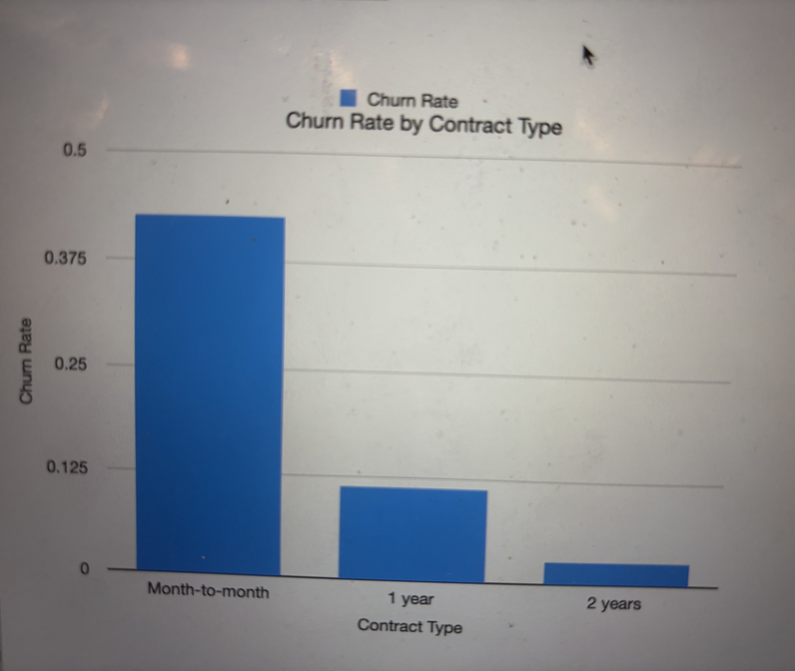

# telco-customer-churn
# Objective
This project analyzes customer data from a telecommunications company to identify the key factors that drive customer churn. The goal is to understand which types of customers are most likely to leave and highlight actionable insights to improve retention.
# Dataset
The dataset contains approximately 7,000 customers and includes information on:
Customer tenure (length of time with the company),
Contract type (month-to-month, one-year, two-year),
Monthly and total charges,
Internet service type,
Churn status (Yes/No)
# Methodology
Cleaned and selected relevant variables from the dataset

Created derived features (e.g., tenure groups) to analyze customer lifecycle stages

Used pivot tables to calculate churn rates across different segments

Built visualizations to clearly communicate key patterns
# Key Findings
1. Contract Type and Churn
Customers on month-to-month contracts churn at significantly higher rates than those on longer-term contracts.

Month-to-month: 42.7%,
One-year: 11.3%,
Two-year: 2.8%.

Insight:
Long-term contracts are strongly associated with lower churn, suggesting that customer commitment plays a major role in retention.

2. Customer Tenure and Churn

Churn is highest among newer customers and declines steadily over time.

0–12 months: 47.4%,
13–24 months: 28.7%,
25–48 months: 20.4%,
49+ months: 9.5%

Insight:
Customers in their first year are significantly more likely to churn, indicating that early-stage retention is critical.
# Conclusion
This analysis shows that customer churn is strongly influenced by both contract structure and customer tenure.

Customers with low commitment (month-to-month contracts) are much more likely to leave.
Customers are most vulnerable to churn early in their lifecycle

These findings suggest that businesses should focus on:

Incentivizing longer-term contracts

Improving onboarding and early customer experience
# Tools Used
Apple Numbers (data cleaning, pivot tables, visualization)
# Notes
This project focuses on clear, interpretable analysis rather than complex modeling. The goal is to demonstrate the ability to extract meaningful insights from real-world data.
